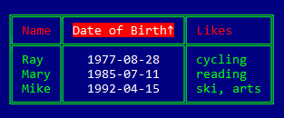

# IO ANSI Table

Prints data to STDOUT in a table with borders and colors.
Can choose a table style to change the look of the table.

## Installation

Add the `:io_ansi_table` dependency to your `mix.exs` file:

```elixir
def deps() do
  [
    {:io_ansi_table, "~> 0.3"}
  ]
end
```

## Usage

In `config/config.exs`, you should then configure the table formatting
[options](https://hexdocs.pm/io_ansi_table/IO.ANSI.Table.Options.html).

## Examples

```elixir
config :io_ansi_table, headers: [:name, :dob, :likes]
config :io_ansi_table, header_fixes: %{~r[dob]i => "Date of Birth"}
config :io_ansi_table, sort_specs: [asc: :dob]
config :io_ansi_table, align_specs: [center: :dob]
config :io_ansi_table, margins: [top: 2, bottom: 2]
```

```elixir
alias IO.ANSI.Table
people = [
  %{name: "Mike", likes: "ski, arts", dob: "1992-04-15"},
  %{name: "Mary", likes: "reading"  , dob: "1985-07-11"},
  %{name: "Ray" , likes: "cycling"  , dob: "1977-08-28"}
]
Table.format(people, style: :light)
Table.format(people, style: :medium)
Table.format(people, style: :dark)
```
## 

## Notes

For side-by-side tables, you can specify negative top margins.

These 2 packages use `:io_ansi_table` as a dependency to tabulate data fetched
from the web:
  - [Github Issues](https://hex.pm/packages/github_issues)
  - [NOAA Observations](https://hex.pm/packages/noaa_observations)

## Customization

You can create new table styles or modify any predefined one by changing the
dependency's `config/config.exs` file. You would then need to run
`mix deps.compile io_ansi_table [--force]` to make the changes effective.

## Latest version

The latest version supports:

  - sorting on multiple headers
  - alternating row attributes
  - alignment of column elements
  - sort direction indicators
  - negative top margins
