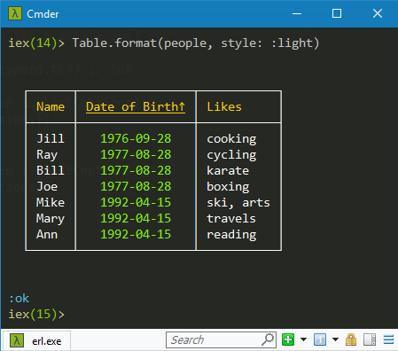
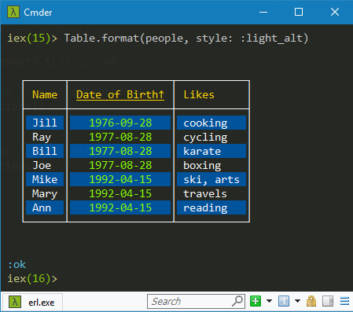
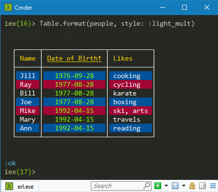
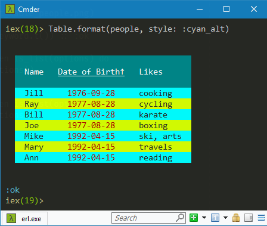

# IO ANSI Table

Prints data to STDOUT in a table with borders and colors.
Can choose a table style to change the look of the table.

## Installation

Add the `:io_ansi_table` dependency to your `mix.exs` file:

```elixir
def deps() do
  [
    {:io_ansi_table, "~> 0.4"}
  ]
end
```

## Usage

In your `config/config.exs`, you should then configure the table formatting
[options](https://hexdocs.pm/io_ansi_table/IO.ANSI.Table.Options.html).

## Examples

```elixir
config :io_ansi_table, headers: [:name, :dob, :likes]
config :io_ansi_table, header_fixes: %{~r[dob]i => "Date of Birth"}
config :io_ansi_table, sort_specs: [asc: :dob]
config :io_ansi_table, align_specs: [center: :dob]
config :io_ansi_table, margins: [top: 2, bottom: 2]
```

```elixir
alias IO.ANSI.Table
people = [
  %{name: "Mike", likes: "ski, arts", dob: "1992-04-15", bmi: 23.9},
  %{name: "Mary", likes: "travels"  , dob: "1992-04-15", bmi: 26.8},
  %{name: "Ann" , likes: "reading"  , dob: "1992-04-15", bmi: 24.7},
  %{name: "Ray" , likes: "cycling"  , dob: "1977-08-28", bmi: 19.1},
  %{name: "Bill", likes: "karate"   , dob: "1977-08-28", bmi: 18.1},
  %{name: "Joe" , likes: "boxing"   , dob: "1977-08-28", bmi: 20.8},
  %{name: "Jill", likes: "cooking"  , dob: "1976-09-28", bmi: 25.8}
]
Table.format(people, style: :light)
Table.format(people, style: :light_alt)
Table.format(people, style: :light_mult)
Table.format(people, style: :cyan_alt)
Table.format(people, style: :cyan_mult)
```
## 
## 
## 
## 
## 

## Notes

For side-by-side tables, you can specify negative top margins.

In addition to the 16 regular ANSI colors and their background counterparts,
this package also supports the 256 Xterm colors (foreground and background).
Most of these 256 colors were given names like
<span style="back-ground-color:#00ffff;">`:aqua`</span>,
<span style="back-ground-color:#87ff00;">`:chartreuse`</span>,
<span style="back-ground-color:#d700ff;">`:psychedelic_purple`</span>.
For details, see file `config/persist_colors.exs`.

The following 2 packages use `:io_ansi_table` as a dependency to tabulate
data fetched from the web:

  - [Github Issues](https://hex.pm/packages/github_issues)
  - [NOAA Observations](https://hex.pm/packages/noaa_observations)

## Customization

You can create new table styles or modify any predefined one by changing the
dependency's `config/persist_styles.exs` file. You would then need to run
`mix deps.compile io_ansi_table [--force]` to make the changes effective.

## Latest version

The latest version supports:

  - sorting on multiple headers
  - alternating row attributes
  - alignment of column elements
  - sort direction indicators
  - negative top margins
  - ANSI and Xterm-256 colors
